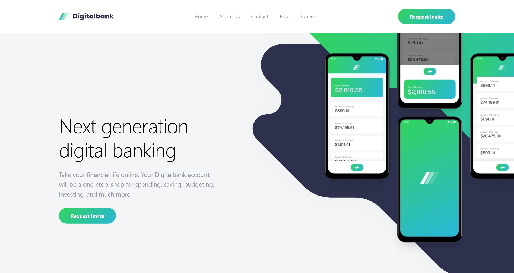

# Frontend Mentor - DigitalBank landing page solution

This is a solution to the [DigitalBank landing page challenge on Frontend Mentor](https://www.frontendmentor.io/challenges/digital-bank-landing-page-WaUhkoDN).

## Table of contents

- [Overview](#overview)
  - [The challenge](#the-challenge)
  - [Screenshot](#screenshot)
  - [Links](#links)
- [My process](#my-process)
  - [Built with](#built-with)
  - [What I learned](#what-i-learned)
  - [Useful resources](#useful-resources)
- [Author](#author)

## Overview

### The challenge

Your challenge is to build out this landing page and get it looking as close to the design as possible.

You can use any tools you like to help you complete the challenge. So if you've got something you'd like to practice, feel free to give it a go.

Your users should be able to:

- View the optimal layout for the site depending on their device's screen size
- See hover states for all interactive elements on the page

### Screenshot



### Links

(Solution URL to be added)

- Solution URL: [Add solution URL here](https://your-solution-url.com)
- Live Site URL: [https://digital-bank-home-page.netlify.app/](https://digital-bank-home-page.netlify.app/)

## My process

### Built with

- Semantic HTML5 markup
- CSS custom properties
- Flexbox
- CSS Grid
- Mobile-first workflow
- [TailwindCSS] - CSS Utility class library
- [AstroJS](https://astro.build/) - JS Framework

### What I learned

#### Overflow scroll issue when using background SVGs.

I've always found large SVGs background graphics a bit annoying to style and the one in this project was no different. The issue I had with it was that the design needed it to cut off from the right side of the screen. I done this originally using **Position: absolute** and it seemed to work quite easily at first.

I then ran into a problem where the SVG was causing an overflow on the right and causing the width of the screen to match the size of the SVG and caused a massive gap between the SVG and the rest of the website content but the weird thing was that this was only happening on mobiles and tablets and NOT on computers, so I knew it wasn't a specific browser issue because the same browser was giving me different results depending on the device and not the browser.

After a lot of trial and error I finally solved the issue. I did this by expanding the parent element to always be the farthest right of the screen width it can be, I then had the SVG to be absolute to that element and cut off the overflow from that parent. Then as the screen became larger, the parent would match the width and slowly reveal the SVG without causing any layout shifting effects. I feel like it's similar to opening up a scroll or map and slowly revealing its contents.

#### Advanced tailwindCSS techniques like creating own ultilities.

In almost every project I've built I always created my own layout grids with bleed sections. This is a common grid layout which is used in alot of sites, in order to structure and keep most of the sites content in line with each other, while also allowing certain sections like images or footer sections to stretch the entire screen width. 

While building this project, I wanted to know if there was a better way to do that than what I had been doing or if there were any best practices I could follow, So I decided to research into it and not only stumbled upon many different ways of implementing it in a better, more responsive & streamlined approaches but I also found a better way of using them within Tailwind.

In my old way of using them I would create 3 or 4 different template-columns and apply these to the overall layout and sections that needed them. This was really inefficient because it meant I also had to apply these multiple times to the same elements along with there media queries to change the grid based on the screen size. Which means I also had to go and make a change in multiple places if I wanted to change anything.

In the new way of doing this I created a more responsive grid and have started using custom Tailwind utility classes. This makes it so much easier because all I have to do is add a single class to element for the grid columns and just a single class to the elements I need too. For example, a **col-content** for a section I want to have a max-width to match the rest of the layout, or a **col-full** to the elements I want to be a bleed section. 

I also added the media query changes inside the utility class it self and I also created a responsive middle column to have a max-width for the content to make the overall grid more responsive and I don't have to change the width of the outer columns for when they get too big. By making these changes it also allow me to have a single source, so if I wanted to change anything, all I had to do is change the value in the one place and it would change everywhere else in the project.

##### Old Way

```css
@theme {
  --grid-template-columns-bleed-mobile: 24px repeat(10, 1fr) 24px;
  --grid-template-columns-bleed-tablet: 40px repeat(10, 1fr) 40px;
  --grid-template-columns-bleed-desktop: 165px repeat(10, 1fr) 165px;
}
```

##### New Way

```css
@theme {
  --gutter-mobile: 24px;
  --gutter-tablet: 40px;
  --gutter-tablet-lg: 80px;
  --gutter-desktop: 80px;
}

@utility col-content {
  grid-column: 2 / 3;
}

@utility col-full {
  grid-column: 1 / -1;
}

@utility col-half {
  grid-column: 2 / 3;
  @media (min-width: 1024px) {
    grid-column: 2 / -1;
  }
}

@utility grid-layout {
  display: grid;
  grid-template-columns:
    minmax(var(--gutter-mobile), 1fr)
    minmax(0, var(--container-max-width))
    minmax(var(--gutter-mobile), 1fr);
  @media (width >= 424px) {
    grid-template-columns:
      minmax(var(--gutter-tablet), 1fr)
      minmax(0, var(--container-max-width))
      minmax(var(--gutter-tablet), 1fr);
  }
  @media (width >= 768px) {
    grid-template-columns:
      minmax(var(--gutter-tablet-lg), 1fr)
      minmax(0, var(--container-max-width))
      minmax(var(--gutter-tablet-lg), 1fr);
  }
}
```

#### Using different types of responsive grid techniques.

I've used this type of technique many times before, usually using only the **minmax()** function to make the column grids responsive but sometimes I'd run into issues where if the column had reached their limit in fixed width the item would burst or overflow. I then stumbled upon a [Kevin Powell](https://www.youtube.com/watch?v=R1kiLX-Z-Io) video that seemingly had a solution to this problem by using the **min()** inside of the **minmax()**. Doing it this way allowed the min() to have two different values and it would then use which of the two values is the smallest and this would make the column responsive. **minmax(min(230px, 100%), 1fr)**

```css
grid-template-columns: repeat(auto-fit, minmax(min(230px, 100%), 1fr));
```

#### Using Dialog element for the sidebar navigation.

This was only the second time using the **dialog** element to build a navigation sidebar and I've decided to not use it again in order to build sidebars. The main reason being is that I felt it was too much of a hassle and a fight against it's default styles to get it to work in way I needed or wanted it to. Going forward I will use the dialog for modals as I feel it is suited perfect for that need. I will use the popoverAPI for popups like tool tips, maybe even for small menus and select menus. For sidebars, I will stick to using the aside element for building them.

### Useful resources

- [Dialog Element](https://developer.mozilla.org/en-US/docs/Web/API/HTMLDialogElement/closedBy)

- [Kevin Powell | YouTube Video | CSS Layout Patterns](https://www.youtube.com/watch?v=R1kiLX-Z-Io)

- [Josh Comeau | Blog Article | Full-Bleed Layout Using CSS Grid](https://www.joshwcomeau.com/css/full-bleed/)

- [Master.dev | Blog Article | Super Simple Full-Bleed & Breakout Styles](https://master.dev/blog/super-simple-full-bleed-breakout-styles/)

- [TailwindCSS | Docs | Adding Custom Utility Classes](https://tailwindcss.com/docs/adding-custom-styles#adding-custom-utilities)

## Author

- Website - [David Henery](https://www.djhwebdevelopment.com/)
- Frontend Mentor - [@David-Henery4](https://www.frontendmentor.io/profile/David-Henery4)
- LinkedIn - [David Henery](https://www.linkedin.com/in/david-henery-725458241/e)
